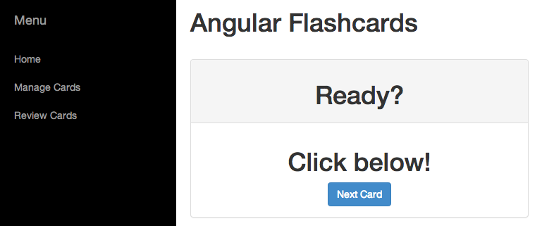

# Ng-Cards

A simple flashcard app. I made this as a way of getting back up to speed on Angular because I hadn't touched used it for over a year.

I feel like the TodoMVC thing is over done. It doesn't do a good job of showcasing a framework's multi-view abilities for SPA's.

Feel free to poke around and learn.

If I have learned anything from this brief re-introduction to Angular it's that **Angular has come a long way in one year**. Angular is ready for production use, IMHO.

# Demo / Screenshots

[Click here to see a live demo](http://rickcarlino.github.io/ng-flashcards)

# How to run

1. clone the repo
2. `node ./server`
3. visit http://localhost:8000/index.html
